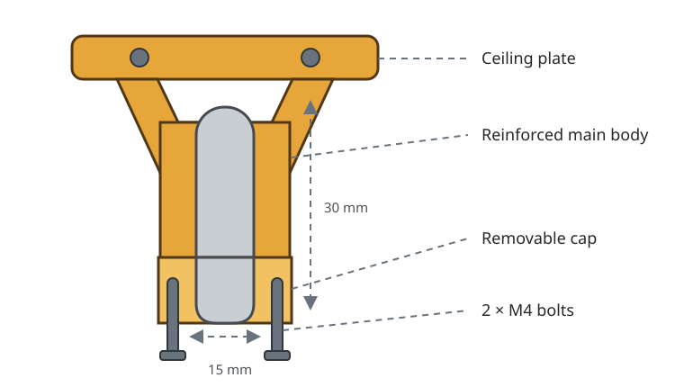

# Ceiling wardrobe rail bracket

Parametric OpenSCAD model for mounting a vertical 30 × 15 mm rounded-rectangle
wardrobe rail to a ceiling. The rail has 7 mm corner radii and is captured by a
removable lower cap.



## Hardware for one bracket

- 2 × M4 × 25 mm socket-head machine screws
- 2 × standard M4 hex nuts (7 mm nominal across flats)
- 2 × 4 mm countersunk ceiling screws
- Ceiling anchors appropriate for the ceiling construction and intended load

Do not select ceiling anchors by screw size alone. Plasterboard, masonry,
concrete, timber, and suspended ceilings require different fastening methods.

## Ready-to-print Bambu P1S project

[`dist/wardrobe_rail_bracket_P1S_0.4_PLA_2x.gcode.3mf`](dist/wardrobe_rail_bracket_P1S_0.4_PLA_2x.gcode.3mf)
is sliced for **two complete brackets** on a Bambu Lab P1S with a 0.4 mm
nozzle, Textured PEI Plate, and Bambu PLA Basic. It was produced with Bambu
Studio 2.7.1.62 and contains the models, project settings, preview, and printer
toolpaths.

The embedded profile uses 0.20 mm layers, 5 walls, 6 top and bottom layers,
40% gyroid infill, a 5 mm outer brim with a 0.1 mm gap, and no supports. The
official slicer reports 150 layers, approximately 115.66 g of filament, and an
estimated print time of 5 h 03 min. Review the selected filament and build plate
in Bambu Studio before sending it to the printer.

Bambu Studio records its standard enclosed-printer PLA advisory because the
stock Textured PEI profile uses a 55 °C bed. For this long PLA print, open the
P1S front door and/or remove the upper glass so chamber heat does not soften the
filament and cause an extruder clog. The advisory is intentionally retained;
the material heat limit and official bed temperature have not been falsified to
hide it.

## Exporting the parts

Open `wardrobe_rail_bracket.scad` in OpenSCAD and set `part` near the top of the
file:

```scad
part = "main_print"; // main part in its recommended print orientation
part = "cap_print";  // cap in its recommended print orientation
```

The default `part = "print"` places both pieces on the build plate in their
recommended orientations. `part = "assembly"` shows the installed arrangement;
OpenSCAD preview also displays a translucent reference rail.

Command-line export is supported:

```bash
openscad -o wardrobe-bracket-main.stl -D 'part="main_print"' wardrobe_rail_bracket.scad
openscad -o wardrobe-bracket-cap.stl -D 'part="cap_print"' wardrobe_rail_bracket.scad
```

The `main` and `cap` modes retain the installed assembly coordinates and are
useful for CAD inspection rather than direct slicing.

All principal dimensions are top-level parameters. The default rail socket is
30.6 × 15.6 mm with a 7.3 mm radius, providing 0.3 mm nominal clearance on each
side. Print a short fit sample or adjust `rail_clearance` if the printer or rail
needs a different tolerance.

## Suggested PLA print settings

- 0.2 mm layer height or finer
- At least 5 perimeters/walls
- At least 6 top and bottom layers
- 40–60% cubic or gyroid infill
- No supports should be required in the supplied print layout; inspect the
  preview for the selected printer and slicer

The main part prints with its ceiling-contact face on the bed. The cap has a
flattened exterior face for bed adhesion; its downward-facing bolt-head recesses
start at that face and print upward from the build plate. Avoid changing these
orientations casually: layer direction is part of the load-bearing design.

PETG or another tougher, more creep-resistant material is preferable for warm
locations or long-term heavy loading. If using a material other than PLA,
re-check hole and rail clearances with a fit sample.

## Assembly

1. Slide one M4 nut into each side-loading hexagonal pocket in the main body.
2. Fasten the main body to structural ceiling material using both countersunk
   holes and suitable anchors.
3. Lift the rail into the downward-facing upper saddle.
4. Place the lower cap around the rail, with its bolt-head recesses facing down.
5. Insert the two M4 × 25 mm bolts and tighten them evenly. Stop once the cap is
   secure; do not crush the rail or strip the printed part.

The 0.6 mm gap between the body and cap provides take-up for tolerance. A small
visible gap after tightening is normal.

## Safety and loading

The geometry is deliberately substantial and targets a 20 kg static load per
bracket, but it is **not structurally certified**. Capacity depends on filament
quality and age, print temperature, layer adhesion, bracket spacing, rail span,
ambient heat, ceiling construction, screws, and anchors. PLA also creeps under
sustained load.

Use multiple brackets, keep people clear during testing, and proof-load the
installed rail gradually with a non-fragile load before hanging clothes. Inspect
the brackets periodically for cracks, loosening, distortion, or cap movement.
Do not use the model where failure could injure someone or for human-supporting,
overhead lifting, or safety-critical applications.

## Verification

Run the automated render checks with:

```bash
python3 -m unittest discover -s tests -v
```

The tests compile every output mode with OpenSCAD, inspect the binary STL
envelopes and screw-access paths, exercise custom rail dimensions, verify
invalid geometry is rejected, and validate the embedded P1S settings and G-code
checksum in the ready-to-print project.
